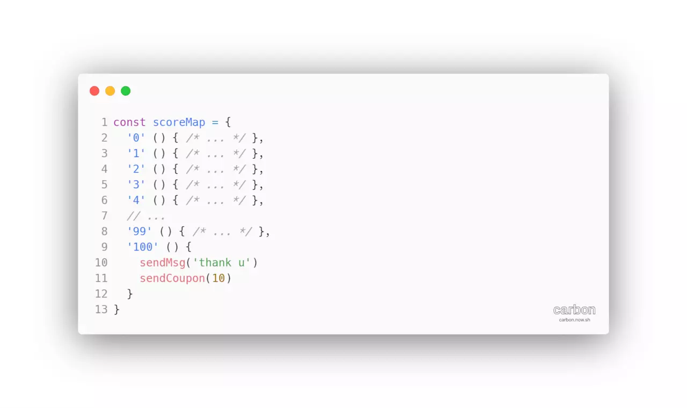

# 少写if-else
> Map使用-你本可以少写些if-else

## Map
Map 对象保存键值对。任何值(对象或者原始值) 都可以作为一个键或一个值。

### 语法
```js
new Map([iterable])
```
`Iterable` 可以是一个数组或者其他 `iterable` 对象，其元素为键值对(两个元素的数组，例如: `[[ 1, 'one' ],[ 2, 'two' ]])`。 每个键值对都会添加到新的 `Map`。`null` 会被当做 `undefined`。
### 属性
- size
### 方法
- clear()
- delete(key)
- entries() 返回一个新的包含 [key, value] 的 Iterator 对象
- forEach(callbackFn[, thisArg])
- get(key)
- has(key)
- keys()
- values()
- set(key, value)

### 例子
#### 使用 Map 对象
```js
var myMap = new Map();

var keyObj = {},
    keyFunc = function () {},
    keyString = "a string";

// 添加键
myMap.set(keyString, "和键'a string'关联的值");
myMap.set(keyObj, "和键keyObj关联的值");
myMap.set(keyFunc, "和键keyFunc关联的值");

myMap.size; // 3

// 读取值
myMap.get(keyString);    // "和键'a string'关联的值"
myMap.get(keyObj);       // "和键keyObj关联的值"
myMap.get(keyFunc);      // "和键keyFunc关联的值"

myMap.get("a string");   // "和键'a string'关联的值"
                         // 因为keyString === 'a string'
myMap.get({});           // undefined, 因为keyObj !== {}
myMap.get(function() {}) // undefined, 因为keyFunc !== function () {}
```
#### 使用 for..of 方法迭代 Map

```js
var myMap = new Map();
myMap.set(0, "zero");
myMap.set(1, "one");
for (var [key, value] of myMap) {
  console.log(key + " = " + value);
}
// 将会显示两个log。一个是"0 = zero"另一个是"1 = one"

for (var key of myMap.keys()) {
  console.log(key);
}
// 将会显示两个log。 一个是 "0" 另一个是 "1"

for (var value of myMap.values()) {
  console.log(value);
}
// 将会显示两个log。 一个是 "zero" 另一个是 "one"

for (var [key, value] of myMap.entries()) {
  console.log(key + " = " + value);
}
// 将会显示两个log。 一个是 "0 = zero" 另一个是 "1 = one"
```
#### 使用 forEach() 方法迭代 Map

```js
myMap.forEach(function(value, key) {
  console.log(key + " = " + value);
}, myMap)
// 将会显示两个logs。 一个是 "0 = zero" 另一个是 "1 = one"
```
## 你本可以少写些 if-else
### if/else
我们以一个售后流程为例. 用户购买商品后, 可能会因为错件漏件/质量问题/描述不符等原因联系商家进行售后服务, 其中可能会涉及退款/退货/换货/补发等售后支持服务, 商家对此次售后的服务情况也会影响用户对商家的喜好. 在这样的场景下, 我们假设以下伪代码:


### 配置数据与业务逻辑分离


### 更加灵活的数据配置
上一节使用了对象进行数据配置, 如果说有那么一点遗憾的地方, 那就是尽管属性的值可以为任意类型, 但是属性本身却只能是字符串类型, 这使得某些场景下我们不能很好的发挥配置逻辑分离的作用. 想象以下场景: 每个月末, 商家会挑选出狂热粉丝(喜爱程度大于等于100)发送留言"感谢你"并赠送10元优惠券, 普通粉丝(分数0-100)发送留言"感谢", 黑粉(分数小于0)发送"抱歉"并赠送10元优惠券.

等等, 喜爱程度分数是不定的!

显然我们不能用对象去处理这样的数据(只要我还没疯掉), 如下:



使用Map进行数据配置是非常棒的一种写法, 但是如果你必须兼容IE浏览器的话, 你必须考虑使用其它的数据结构用于替代Map:


## 摘自
- https://juejin.im/post/5cead18df265da1bc552405b
- [MDN-iterator](https://developer.mozilla.org/en-US/docs/Web/JavaScript/Reference/Global_Objects/Symbol/iterator)
- [MDN-Map](https://developer.mozilla.org/en-US/docs/Web/JavaScript/Reference/Global_Objects/Map)
- [MDN-Generator](https://developer.mozilla.org/en-US/docs/Web/JavaScript/Reference/Global_Objects/Generator)

## 今日图 - 结局引起极度舒适

