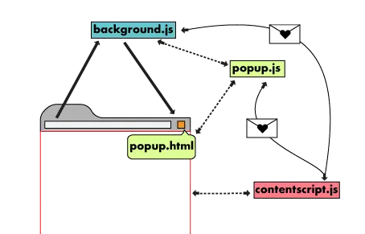
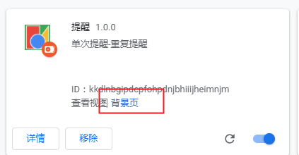

# chrome插件开发
> 文章暂时不完整，可能存在错误，待补充
## 文件结构


```
chrome-plugin-demo
├── background.js
├── images
│   ├── 128.png
│   ├── 16.png
│   ├── 32.png
│   └── 48.png
├── manifest.json
├── popup.html
└── popup.js

```
### manifest.json
```json
{
  "name": "提醒",
  "version": "1.0.0",
  "description": "单次提醒-重复提醒",
  "manifest_version": 2,
  "permissions": [
    "notifications",
    "alarms",
    "storage"
  ],
  "background": {
    "scripts": [
      "background.js"
    ],
    "persistent": false
  },
  "browser_action": {
    "default_icon": {
      "16": "images/get_started16.png",
      "32": "images/get_started32.png",
      "48": "images/get_started48.png",
      "128": "images/get_started128.png"
    },
    "default_title": "消息提醒插件",
    "default_popup": "popup.html"
  }
}

```
## 开发安装调试
### 本地安装
- 在 `chrome` 中安装扩展 谷歌浏览器右上角: 更多按钮 -> 更多工具 -> 扩展程序 
- 点击加载已解压的扩展程序，选择刚创建的文件夹
- 点开谷歌浏览器右上角的拼图图标即可看到你的插件。
### 调试后台脚本 background.js
> 后台脚本是扩展程序的事件处理程序，其中包含扩展程序的事件监听器，可以在后台运行，只在需要时才加载，在空闲时不加载。

特点：

- Javascript 文件总是运行在后台.
- 有 Chrome 应用程序级别命令的访问权限。
- 有使用所有 Chrome API 的权限

调试:



### 用户页面 popup.html
调试：

找到本地安装的插件，右键点击审查弹出内容即可。

## Api
- chrome.extension.getBackgroundPage() 返回 background.js 的变量,是 popup.js 获取背景页的桥梁
- chrome.storage.sync.onChanged.addListener 监听本地缓存变化
    - chrome.storage.sync.clear
    - chrome.storage.sync.set
    - chrome.storage.sync.get
- chrome.alarms.getAll 获取提醒的 api
    - clear
    - clearAll
    - create
- chrome.alarms.onAlarm.addListener 监听 alarm 变化
- chrome.notifications.create 提醒
- chrome.runtime.onInstalled.addListener 加载插件初始化监听

## 注意

`popup.html` 的 `js` 需要外部引入。
