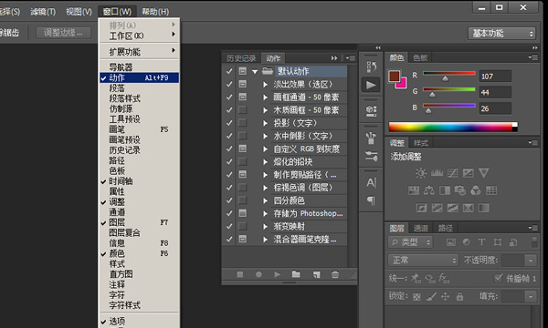

# 使用PS批量修改图片大小
Photoshop有自动批处理功能，你只需要录制好处理一张图片的动作，选择源文件夹和目标文件夹后，几百张图片的处理可以瞬间完成。下面我们简单说一个使用 `PS` 批量修改图片大小的步骤。

## 创建文件夹

把要修改大小的源图片放到一个文件夹里，再新建一个文件夹用于保存修改后的小图片，这里我要把“原图”文件夹里的四张图片修改成宽度为800像素的小图，并保存到“小图”文件夹里。

## 打开PS软件

选择 `<窗口><动作>或按Alt + F9` ，调出动作面板，这里我们看到PS已经有一些默认动作，但我们只需要修改大小，所以我们点击下面的文件夹图标，新建一个动作组并命名为"修改大小"点击确定。

## 修改一张图片

然后我们打开一张我们需要修改的图片后，点击动作面板最下面新建动作按钮，点击`“记录”`这时动作面板下面的圆形的记录按钮变成红色，说时 `PS` 已经开始在记录你的每一个动作。

## 记录动作

这里我们要把图片大小都改成`600像素`宽，所以我们选择`<图像><图像大小>`，在弹出的框里，把宽度改为600，由于高宽比是锁定的，宽度一改高度也会自动变化，点击确定。我们会看到图片变小后，动作面板也下面多出一条名叫“图像大小”的记录，说明软件已经把这个动作记录下来了。

## 结束录制
我们继续选择菜单的`<文件><存储为>`把修改好大小的图片保存到原来我们建好的“小图”文件夹，然后点击动作面板下面的正方形的停止按钮结束动作录制。

## 批处理

接下来我们就可以真正执行`批处理`了，选择菜单`<文件><自动><批处理>`在弹出的框中设置好要处理的源文件夹和要保存到的目标文件夹后，点击确定，神奇发生了，PS开始飞快的自动处理一张张图片，等完成后，到"小图"文件夹里查看，原图文件夹里所有的图片都已经改成我们想要的大小，是不是太方便了。

这里我们只是介绍了最简单的批处理功能，你也可以录制更多更复杂的动作，让`PS`更好的为你工作。

