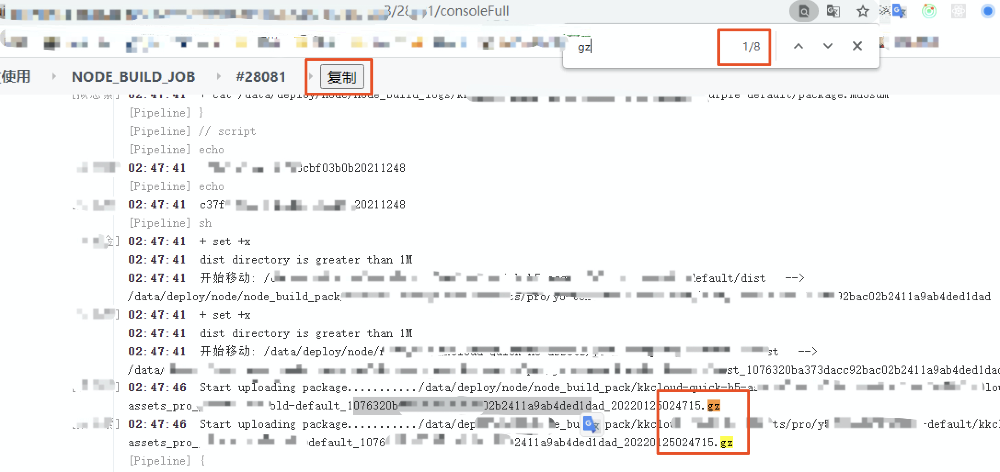
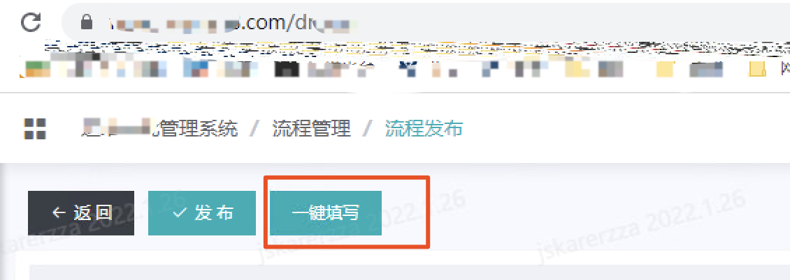
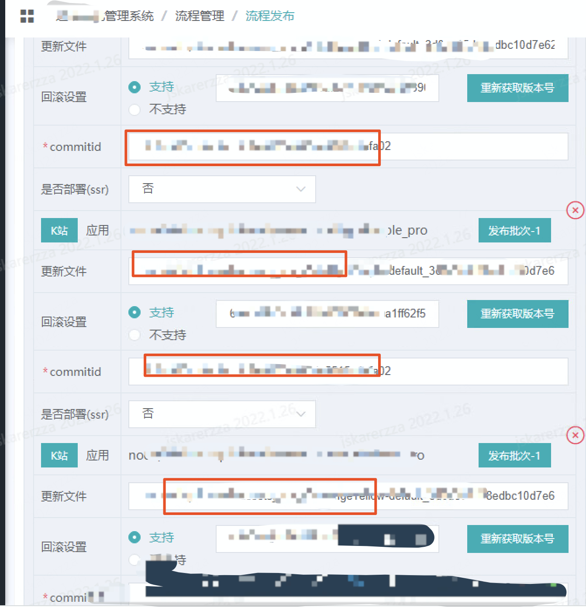

# 油猴插件开发
>自我理解：可以用js实现自定义功能、跨页面自动化填写表单

## demo
- @include 哪些页面可以共享
- @grant 写入授权的全局变量
```js
// ==UserScript==
// @name         New Userscript
// @namespace    http://tampermonkey.net/
// @version      0.1
// @description  try to take over the world!
// @author       You
// @match        https://www.baidu.com/
// @include      https://zhuanlan.zhihu.com/p/*
// @include      https://www.baidu.com/
// @icon         https://www.google.com/s2/favicons?sz=64&domain=baidu.com
// @grant        GM_setValue
// @grant        GM_getValue
// ==/UserScript==

(function() {
  'use strict';
  // 百度页面添加的按钮
  const wrapper = document.getElementById('s_top_wrap')
  // 复制按钮
  function createCopyBtn(){
    const btn = document.createElement('button')
    btn.innerText = '复制'
    btn.addEventListener('click', () => {
      const str = document.getElementsByTagName('body')[0].innerText
      console.log(str)
      // 保存数据
      GM_setValue('log_data', str)
    })
    wrapper.appendChild(btn)
  }
  wrapper && createCopyBtn()
  // 一键填写
  function start(){
    const btn = document.createElement('button')
    btn.innerText = '一键填写'
    btn.addEventListener('click', () => {
      // 可在其他页面取出数据
      console.log(GM_getValue('log_data'))
    })
    wrapper.appendChild(btn)
  }
  wrapper && start()
})();

```
### 分享下我做了的功能
通过A页面获取 jks 全部信息，通过 js 正则取出有用信息，一键填写B页面内的表单
#### A页面
- 复制按钮是 js 获取 dom 添加的
- 搜索全局有8个 gz 结尾的有用信息，用 `GM_setClipboard` 可以把复合条件的复制到剪贴板
- 点击复制通过 `document.getElementsByTagName('body')[0].innerText` 获取到存入 `GM_setValue('log_data', str)` 用于在B页面取出

#### B页面
- 一键填写是 js 获取 dom 添加的
- table 表单输入框比较多，获取A页面内容 `GM_getValue('log_data')` 通过正则匹配到，然后通过 js 操作 dom 获取想要填入的相关输入框填入即可


  
## 坑点
- 可能只是把 `input` 值做了变化实际表单提交的时候没有获取到
```js
// js模拟键盘给input框输入值
let t = document.getElementsByClassName('c_l_area c_a_n')[0];
let evt = new Event("input", {"bubbles":true, "cancelable":true});
t.value = 'setValue';
t.dispatchEvent(evt)
```
## 引用
- [油猴脚本文档](https://www.tampermonkey.net/documentation.php?ext=dhdg)
- [【轻松上手】油猴脚本开发](https://juejin.cn/post/7022654292880424991)
- [油猴跨域数据传输脚本](https://segmentfault.com/a/1190000039978750)
